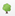
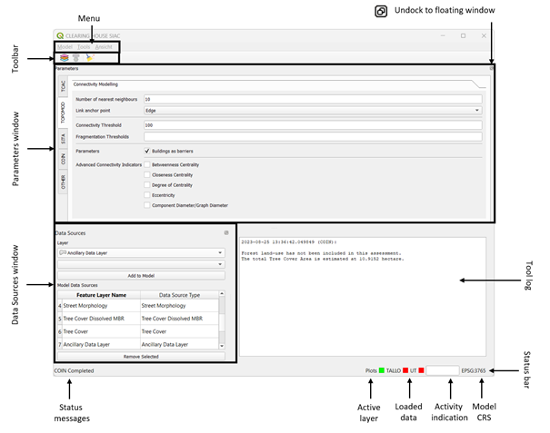
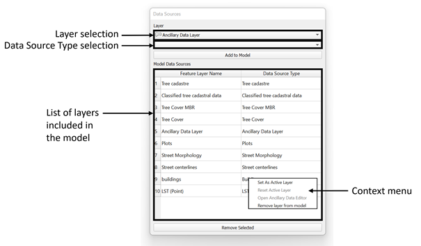
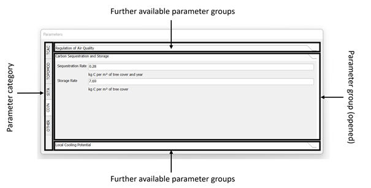
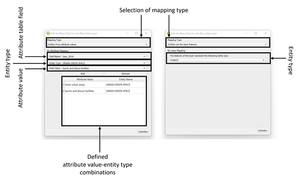
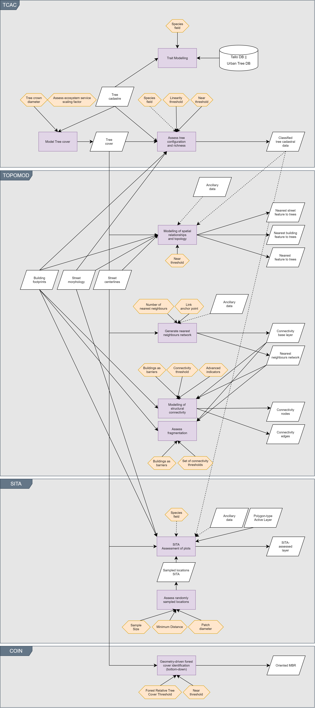
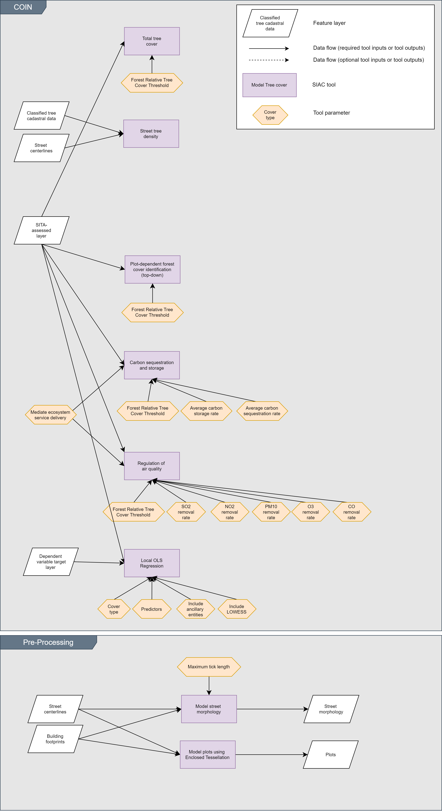
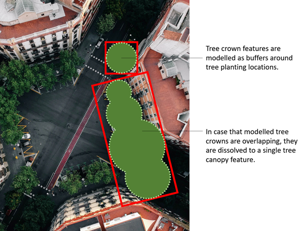
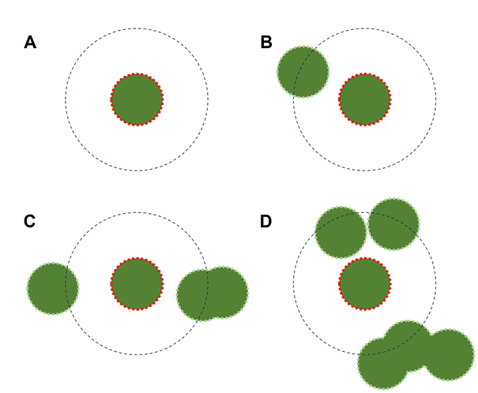

# **Objectives**

The SIAC tool is developed by the CLEARING HOUSE project to assist in
assessing conditions of urban forest as nature-based solutions (UF-NBS)
and estimate benefits provided by UF-NBS at a local level. For example,
SIAC is intended to support addressing the following challenges:

- Modelling/assessment of tree cover, thereby contributing to IUCN’s
  urban nature index theme 3.1: Identification of (trends in) vegetation
  cover (IUCN, 2023).

- Assessment of tree species richness and diversity, thereby
  contributing to IUCN’s urban nature index theme 4.2: Identification of
  (trends in) plant species diversity (IUCN, 2023).

- Modelling/assessment of tree cover connectivity, thereby contributing
  to IUCN’s urban nature index theme 3.5: Identification of (trends in)
  connectivity (IUCN, 2023). Moreover, through an identification of
  articulation points and bridges, SIAC may support decision-making on
  maintaining connectivity through identifying nodes and links (edges)
  important for overall connectivity.

- Rapid, indicator-based assessment of tree cover benefits. This
  includes, for example, indicators on carbon storage and carbon
  sequestration, or on the regulation of air quality through the removal
  of pollutants. Thereby, SIAC may contribute to IUCN’s urban nature
  index theme 5.3: Human health (IUCN, 2023).

# Requirements and installation

## Requirements and dependencies

SIAC is a toolkit that contains a number of tools for the assessment and
classification of Urban Forest entities. It is written as a plugin for
the QGIS open-source desktop GIS. More-specific dependencies on running
SIAC in QGIS with respect to software versions are as follows:

- QGIS (3.28.2) 64bit

- Python (3.9.X) as bundled with QGIS

Moreover, for the operation of SIAC, the following packages are required
to be installed for QGIS, with the minimum versions as indicated in the
following table. Please make sure that each of these dependencies is
installed with at least the version stated before continuing to install
the plugin itself.

| Package name | Minimum version |
|--------------|-----------------|
| geopandas    | 0.13.0          |
| matplotlib   | 3.5.1           |
| momepy       | 0.6.0           |
| networkx     | 3.1             |
| pandas       | 1.1.3           |
| scikit-learn | 1.3.0           |
| seaborn      | 0.12.2          |
| shapely      | 2.0.1           |
| statsmodels  | 0.14.0          |
| xlsxwriter   | 3.1.2           |

The installation of packages is described in the following section.

## Installation and setup

### QGIS

Make sure that minimum software version of QGIS (3.28.2) is met. Install
a corresponding version if this is not being the case. QGIS can be
downloaded from the following website:
<https://qgis.org/en/site/forusers/download.html>.

### SIAC dependencies

Install required python packages/SIAC dependencies. To do so, open the
environment to conduct the installation of dependencies. This
corresponds to the OSGeo4W shell that is provided with QGIS, therefore:

Open the OSGeo4W shell, e.g., from the start menu/QGIS

In the OSGeo4W shell, check the packages/dependencies that are already
installed. Issue the following command:

*pip list*

In the shell, a list of installed packages will be printed, including
their version number. Check this list against required SIAC dependencies
to identify packages that require installation if not present. To
install a missing dependency, issue the following command:

*pip install \<packagename\>, e.g., to install momepy, enter*  
*pip install momepy*

Alternatively, if a package is already installed, but the version number
is lower than indicated in the table of dependencies, an upgrade of the
package is needed. To do so, issue the following command:

*pip install --upgrade \<packagename\>, e.g., to upgrade networx enter* 
*pip install --upgrade networkx*

### Plugin

At this time, SIAC is not available via the QGIS plugin repository,
therefore, it needs to be installed by hand from the provided zip
archive. To install the plugin, follow the steps outlined below:

- Start QGIS.

- Choose to manage and install extensions from the extensions menu, then
  choose to install from a ZIP file.

- Point to the provided ZIP file, and install.

SIAC should now be installed, activated, and loaded correctly.

# Licenses, Attributions and Acknowledgements

**This tool uses the NetworkX library (Hagberg et al., 2008). NetworkX
is distributed with the 3-clause BSD license.**

Copyright (C) 2004-2023, NetworkX Developers
Aric Hagberg \<hagberg@lanl.gov\>
Dan Schult \<dschult@colgate.edu\>
Pieter Swart \<swart@lanl.gov\>

All rights reserved.
Redistribution and use in source and binary forms, with or without
modification, are permitted provided that the following conditions are
met:

\* Redistributions of source code must retain the above copyright
notice, this list of conditions and the following disclaimer.

\* Redistributions in binary form must reproduce the above
copyright notice, this list of conditions and the following
disclaimer in the documentation and/or other materials provided
with the distribution.

\* Neither the name of the NetworkX Developers nor the names of its
contributors may be used to endorse or promote products derived
from this software without specific prior written permission.
THIS SOFTWARE IS PROVIDED BY THE COPYRIGHT HOLDERS AND CONTRIBUTORS
"AS IS" AND ANY EXPRESS OR IMPLIED WARRANTIES, INCLUDING, BUT NOT
LIMITED TO, THE IMPLIED WARRANTIES OF MERCHANTABILITY AND FITNESS FOR
A PARTICULAR PURPOSE ARE DISCLAIMED. IN NO EVENT SHALL THE COPYRIGHT
OWNER OR CONTRIBUTORS BE LIABLE FOR ANY DIRECT, INDIRECT, INCIDENTAL,
SPECIAL, EXEMPLARY, OR CONSEQUENTIAL DAMAGES (INCLUDING, BUT NOT
LIMITED TO, PROCUREMENT OF SUBSTITUTE GOODS OR SERVICES; LOSS OF USE,
DATA, OR PROFITS; OR BUSINESS INTERRUPTION) HOWEVER CAUSED AND ON ANY
THEORY OF LIABILITY, WHETHER IN CONTRACT, STRICT LIABILITY, OR TORT
(INCLUDING NEGLIGENCE OR OTHERWISE) ARISING IN ANY WAY OUT OF THE USE
OF THIS SOFTWARE, EVEN IF ADVISED OF THE POSSIBILITY OF SUCH DAMAGE.

**This tool uses the momepy library (Fleischmann, 2019). Momepy is
distributed under the 3-clause BSD license.**

Copyright (c) 2018-2021, Martin Fleischmann and PySAL Developers.

All rights reserved.

Redistribution and use in source and binary forms, with or without
modification, are permitted provided that the following conditions are
met:

\* Redistributions of source code must retain the above copyright
notice, this list of conditions and the following disclaimer.

\* Redistributions in binary form must reproduce the above copyright
notice, this list of conditions and the following disclaimer in the
documentation and/or other materials provided with the distribution.

\* Neither the name of the copyright holder nor the names of its
contributors may be used to endorse or promote products derived from this software
without specific prior written permission.

THIS SOFTWARE IS PROVIDED BY THE COPYRIGHT HOLDERS AND CONTRIBUTORS "AS
IS" AND ANY EXPRESS OR IMPLIED WARRANTIES, INCLUDING, BUT NOT LIMITED TO, THE
IMPLIED WARRANTIES OF MERCHANTABILITY AND FITNESS FOR A PARTICULAR PURPOSE ARE
DISCLAIMED. IN NO EVENT SHALL THE COPYRIGHT OWNER OR CONTRIBUTORS BE
LIABLE FOR ANY DIRECT, INDIRECT, INCIDENTAL, SPECIAL, EXEMPLARY, OR CONSEQUENTIAL
DAMAGES (INCLUDING, BUT NOT LIMITED TO, PROCUREMENT OF SUBSTITUTE GOODS OR
SERVICES; LOSS OF USE, DATA, OR PROFITS; OR BUSINESS INTERRUPTION) HOWEVER CAUSED
AND ON ANY THEORY OF LIABILITY, WHETHER IN CONTRACT, STRICT LIABILITY, OR TORT
(INCLUDING NEGLIGENCE OR OTHERWISE) ARISING IN ANY WAY OUT OF THE USE OF
THIS SOFTWARE, EVEN IF ADVISED OF THE POSSIBILITY OF SUCH DAMAGE.

**This tool uses the xlsxwriter library. XlsxWriter is released under a
BSD 2-Clause license.**

XlsxWriter is released under a BSD 2-Clause license.

BSD 2-Clause License

Copyright (c) 2013-2023, John McNamara \<jmcnamara@cpan.org\> All rights
reserved.

Redistribution and use in source and binary forms, with or without
modification, are permitted provided that the following conditions are
met:

\* Redistributions of source code must retain the above copyright notice,
this list of conditions and the following disclaimer.

\* Redistributions in binary form must reproduce the above copyright
notice, this list of conditions and the following disclaimer in the
documentation and/or other materials provided with the distribution.

THIS SOFTWARE IS PROVIDED BY THE COPYRIGHT HOLDERS AND CONTRIBUTORS “AS
IS” AND ANY EXPRESS OR IMPLIED WARRANTIES, INCLUDING, BUT NOT LIMITED
TO, THE IMPLIED WARRANTIES OF MERCHANTABILITY AND FITNESS FOR A
PARTICULAR PURPOSE ARE DISCLAIMED. IN NO EVENT SHALL THE COPYRIGHT
HOLDER OR CONTRIBUTORS BE LIABLE FOR ANY DIRECT, INDIRECT, INCIDENTAL,
SPECIAL, EXEMPLARY, OR CONSEQUENTIAL DAMAGES (INCLUDING, BUT NOT LIMITED
TO, PROCUREMENT OF SUBSTITUTE GOODS OR SERVICES; LOSS OF USE, DATA, OR
PROFITS; OR BUSINESS INTERRUPTION) HOWEVER CAUSED AND ON ANY THEORY OF
LIABILITY, WHETHER IN CONTRACT, STRICT LIABILITY, OR TORT (INCLUDING
NEGLIGENCE OR OTHERWISE) ARISING IN ANY WAY OUT OF THE USE OF THIS
SOFTWARE, EVEN IF ADVISED OF THE POSSIBILITY OF SUCH DAMAGE.

**This tool uses the geopandas library (Jordahl et al., 2020). Geopandas
is distributed under the 3-clause BSD license.**

Copyright (c) 2013-2022, GeoPandas developers.

All rights reserved.

Redistribution and use in source and binary forms, with or without
modification, are permitted provided that the following conditions are
met:

\* Redistributions of source code must retain the above copyright
notice, this list of conditions and the following disclaimer.

\* Redistributions in binary form must reproduce the above copyright
notice, this list of conditions and the following disclaimer in the
documentation and/or other materials provided with the distribution.

\* Neither the name of GeoPandas nor the names of its contributors may
be used to endorse or promote products derived from this software
without specific prior written permission.

THIS SOFTWARE IS PROVIDED BY THE COPYRIGHT HOLDERS AND CONTRIBUTORS "AS
IS" AND ANY EXPRESS OR IMPLIED WARRANTIES, INCLUDING, BUT NOT LIMITED TO, THE
IMPLIED WARRANTIES OF MERCHANTABILITY AND FITNESS FOR A PARTICULAR PURPOSE ARE
DISCLAIMED. IN NO EVENT SHALL THE COPYRIGHT OWNER OR CONTRIBUTORS BE
LIABLE FOR ANY DIRECT, INDIRECT, INCIDENTAL, SPECIAL, EXEMPLARY, OR CONSEQUENTIAL
DAMAGES (INCLUDING, BUT NOT LIMITED TO, PROCUREMENT OF SUBSTITUTE GOODS OR
SERVICES; LOSS OF USE, DATA, OR PROFITS; OR BUSINESS INTERRUPTION) HOWEVER CAUSED
AND ON ANY THEORY OF LIABILITY, WHETHER IN CONTRACT, STRICT LIABILITY, OR TORT
(INCLUDING NEGLIGENCE OR OTHERWISE) ARISING IN ANY WAY OUT OF THE USE OF
THIS SOFTWARE, EVEN IF ADVISED OF THE POSSIBILITY OF SUCH DAMAGE.

**This tool uses artwork from the following content creators.**

[Layers icons created by Freepik -
Flaticon](https://www.flaticon.com/free-icons/layers)

[Clear icons created by Flat Icons -
Flaticon](https://www.flaticon.com/free-icons/clear)

[Delete icons created by bqlqn -
Flaticon](https://www.flaticon.com/free-icons/delete)

[Software development icons created by Smashicons -
Flaticon](https://www.flaticon.com/free-icons/software-development)

Deciduous tree icon
Copyright Google

Licensed under the Apache License, Version 2.0 (the "License");
you may not use this file except in compliance with the License.
You may obtain a copy of the License at
http://www.apache.org/licenses/LICENSE-2.0
Unless required by applicable law or agreed to in writing, software
distributed under the License is distributed on an "AS IS" BASIS,
WITHOUT WARRANTIES OR CONDITIONS OF ANY KIND, either express or implied.
See the License for the specific language governing permissions and
limitations under the License.

# Operating SIAC

## Introduction to the SIAC plugin window

### Overview

SIAC provides a QT-based user with its own menu and status bar etc. All
functions of SIAC are accessible through this plugin window. It can be
opened by clicking on the

button in the QGIS toolbar, or by default, pressing CTRL+F9. The plugin
window is shown in the Figure 2.

Central to the plugin window is the tool log, that displays assessment
results and messages to the user. Moreover, the plugin window features
various dockable windows, including a window to manage data sources and
one to set parameters. These dockable windows can be dragged to
different positions of the plugin window (e.g., docked to the
left/right/top/bottom, stacked at a dock position) or undocked entirely
from the plugin window as a floating window for easier accessibility.
The visibility of windows may be toggled in the View menu.

Menu and toolbar provide access to the various tool functionalities.

The status bar at the bottom of the plugin window provides several
indications: An activity indicator and status messages (left);
information regarding user-specified/available data sources (active
layer, external data) (right); and model’s coordinate reference system
(CRS).

Figure 2. SIAC plugin window with “Data Sources” tab shown.

### The Data Sources window

The Data Sources window is shown in Figure 3. It lists all data sources
(layers) included in the SIAC model, and allows adding or removing data
sources to/from the model. When right-clicking on a layer from the list
of included data sources, a context menu is provided with further
available actions.

Figure 3. Data Sources window.

### The Parameters window

The Parameters window allows the user to define various parameters used
in or across the various modules (tools) provided by SIAC.

Parameters are organized into categories, that are broadly aligned with
individual SIAC tool modules. Within each category, parameters are then
grouped, with each group broadly aligned to functions provided by the
tool in question. In so-doing, relevant parameters are typically
displayed side-by-side to facilitate operation of SIAC. The various
parameters are described in detail for each module later in this manual.

Figure 4. The Parameters window.

## Managing SIAC model data

SIAC model data broadly refers to the data sources (layers) included in
a SIAC model. In this regard, SIAC handles various types of spatial data
(layers), with data sources typically falling into one of two distinct
categories: (i) mandatory input layers, that are required by the various
tools as described below; or (ii) ancillary layers, that may be included
in a model to convey additional spatial data with semantic meaning to
SIAC tools. The use of ancillary data layers is optional. They are
supported by a subset of tools, e.g., SITA.

At a general level, for each input layer type, only a single layer per
type is supported by SIAC. However, for layers of type Ancillary Data
Layer, multiple layers of this type may be added to the model.

### Adding layers to a SIAC model

Adding input layers and ancillary data layers is managed in the Data
Sources window. To add data sources to the model, it is initially
suggested to first load all respective data as map layers into QGIS.
Then, in the Data Sources window, conduct the following steps for each
input data source or ancillary data source as outlined below.

1)  Select a feature layer from the *Layer selection* combo box.

2)  Select the appropriate data source type from the *Data Source Type
    selection* combo box. This data source type conveys a semantic
    meaning to SIAC, i.e., it denotes the content of the layer in
    question to the tool. For ancillary layers, select Ancillary Data
    Layer as type.

3)  Click the “Add to Model” button. The layer will be added to the SIAC
    model, and listed accordingly in the list of included layers with
    its layer name and data source type.

Repeat these steps as needed, for each layer that shall be included in
the model. Refer to the documentation to read on input data required by
the various SIAC tools.

Outputs of the various SIAC tools are typically added automatically to
the QGIS map and to the SIAC model upon tool completion.

When opening the plugin for the first time, the coordinate reference
system (CRS) set for the QGIS map frame will automatically be set for
the SIAC model. The current model CRS is shown in the plugin window’s
status bar. When adding a layer to the SIAC model, the layer’s CRS is
checked against the model’s CRS, and an on-the-fly projection is
conducted on the layer if both CRS do not match. Please note that this
process may take some minutes particularly for larger layers.

To facilitate adding layers to the SIAC model, the tool provides a
matching function that attempts to automatically add layers from the
QGIS map frame into the model based on its layer name as shown in the
QGIS Layer window. More specifically, a layer is added to the model if
its layer name is verbatim to a data source type; e.g., a layer named
“Tree Cadastre” is automatically added to the model as a layer of “Tree
Cadastre” data source type. Please refer to the description of input
data sources below for more details on required layers/data source types
per tool module.

The layer matching function can be invoked from the Model menu by
clicking “Resolve data sources”, or using the CTRL+SHIFT+R keyboard
shortcut.

### Removing layers from a SIAC model

There are various options to remove a layer from a SIAC model:

Select the layer to be removed from the list of included layers in the
Data Sources window, then click the button “Remove Selected” located
under the list of included layers.

Alternatively,

Open the context menu by right-clicking on the layer to be removed in
the list of included layers in the Data Sources window, and remove the
layer by selecting the appropriate option from the context menu.

Alternatively,

To remote all layers from the SIAC model, thus clearing all tool data,
select “Remove All” from the File menu.

### Managing the active layer

Various SIAC tool modules, e.g., SITA and COIN, may operate on a
so-called active layer that serves as input layer to these tools.
Consequently, running such SIAC tools requires the active layer to be
set. To do so:

Double-click on a layer in the list of layers included in the SIAC model
in the Data Sources window.

Alternatively,

Right-click on a layer in the list of included layers in the Data
Sources window and select the appropriate option from the context menu.

You may also de-select (reset) the active layer. To do so, follow these
steps:

Right-click in list of layers included in the model to open the context
menu, and choose the appropriate option from the context menu.

Whenever a layer is set as active layer, the corresponding layer name is
shown as confirmation in the plugin window status bar. Additionally, the
corresponding indicator will show in green. If no active layer is set,
“No active layer” is shown in the status bar, with the corresponding
indicator shown in red.

Please note that at this time, only polygon feature layers may be used
as active layer.

### Managing ancillary layers

Ancillary layers provide spatial data with additional semantic meaning
to the SIAC tool. For example, ancillary layers may represent features
of distinct land-use such as urban green spaces, or may represent
features with distinct meaning, e.g., flowerbeds or play equipment. This
meaning is referred to as entities, or entity type. In this regard,
e.g., in the case of land-use, a land-use layer added to the SIAC model
as ancillary data may therefore provide information on multiple entity
types related to land-uses at once, e.g., urban green spaces,
waterbodies, forest.

Entities/entity types may be defined for ancillary data at two distinct
levels:

- At the data source level: Semantic meaning may be defined for an
  ancillary layer as a whole, i.e., all features in the layer are
  considered to represent a given semantic entity (this is referred to
  as “Entities are the layer features” mapping or by-layer mapping);

- At the attribute level: Semantic meaning may be defined for an
  ancillary layer based at the attribute level, i.e., semantic entities
  are defined based on attribute values for a specified field in the
  attribute table (this is referred to as “Entities from attribute
  values” mapping or by-attribute mapping).

To define the semantic meaning of an ancillary data layer, first open
the ancillary data editor (Figure 5).

Open the Ancillary Data Editor Window. To do so, right-click on a given
ancillary layer in the list of layers included in the model in the Data
Sources window, then select the appropriate option from the context
menu.

Then, in the ancillary data editor, proceed as follows to define either
a by-attribute mapping or a by-layer mapping. To define a by-attribute
mapping:

1)  Select the appropriate mapping type from the *mapping type* combo
    box in the ancillary data editor.

2)  From the *Attribute table field selectio*n combo box, select the
    field from the ancillary layer’s attribute table that you wish to
    use for the mapping. Values from this field are subsequently mapped
    to specific entity types.

3)  From the *Entity type* combo box, select an entity type you wish to
    include in the SIAC model.

4)  From the *Attribute value* combo box, select a feature attribute
    value that represents the chosen entity type. For example, for a
    land-use layer, features with a value of “urban green areas” in the
    chosen attribute field may indicate features of the entity type
    “URBAN GREEN SPACE”.

5)  Click the “Add” button to add the attribute value-entity type
    combination to by-attribute mapping. The respective combination of
    values/types will be shown in the list of defined combinations.

Repeat steps steps for all attribute value-entity type combinations, as
needed. To remove an attribute value-entity type combination, select it
from the list of combinations, and click the “Remove” button. Close the
ancillary data editor window when done.

To define a by-layer mapping:

1)  Select the appropriate mapping type from the *mapping type* combo
    box in the ancillary data editor.

2)  Select the entity type that all features in the ancillary layer
    represent.

> Close the ancillary data editor window when done.

Ancillary layers and entities are managed internally by the SIAC tool.
I.e., each SIAC tool processes user-defined entity types internally as
needed, and as supported by the tool.

Figure 5. Ancillary Data Editor window. By-attribute mapping (left) and
by-layer mapping (right).

### Managing external data

SIAC allows importing of external databases for use in selected tool
functions. At this time, the following external databases are supported:
TALLO database (Jucker et al., 2022); and Urban Tree Database (McPherson
et al., 2016). Either database may be imported from the Model/Import
menu.

To import a database, choose the corresponding database type from the
Model/Import menu. Then point to the respective database file, that
needs to be provided in comma-separated values (CSV) format.

When a respective database is imported into the tool, the corresponding
indicator in the status bar will show in green; otherwise, in red.

# SIAC tool modules

## Overview

SIAC comprises various tools (modules) for dedicated purposes. All
tools/modules can be invoked from the Tools menu of the SIAC plugin
window. The following table outlines the purposes of each tool module
briefly.

Table 1. Overview of included tool modules.

| Module                                                                  | Purpose                                                                                                                                                                                                                                                                                                                |
|-------------------------------------------------------------------------|------------------------------------------------------------------------------------------------------------------------------------------------------------------------------------------------------------------------------------------------------------------------------------------------------------------------|
| TCAC (Tree Configuration Assessment and Classification)                 | The TCAC module is primarily concerned with the modelling of tree cover, and the assessment of the spatial-morphological configuration of tree features and of tree species richness and diversity. Further functions provided by the module include, e.g., tools to derive tree traits from supported tree databases. |
| TOPOMOD (Tools for the modelling of spatial relationships and topology) | The TOPOMOD module allows assessing spatial-topological relationships of trees or tree cover with anthropogenic urban features such as streets or buildings, and furthermore implements an assessment of connectivity and fragmentation based on tree-based entities.                                                  |
| SITA (Site assessment)                                                  | The SITA module is intended to derive traits for user-defined spatial units of analysis, i.e., patches/plots delineated by a polygon features.                                                                                                                                                                         |
| COIN (Computation of Indicators)                                        | The COIN module seeks to estimate indicators on urban forest conditions, e.g., tree cover or forest cover, and furthermore seeks to assess benefits, i.e., ecosystem services provided by the urban forest such as the regulation of air quality.                                                                      |
| Pre-Processing                                                          | The Pre-Processing module includes functions for the generation of spatial urban-morphological data if no such data is available, including, e.g., the modelling of street morphology (ground area) and of plots.                                                                                                      |

## Applications of SIAC tool modules

In the following, the application of the various SIAC tool modules is
outlined. To illustrate the scope of each tool, possible research
questions or challenges are listed in Table 2 together with the SIAC
tools that implement functions for addressing each item.

Table 2. Contribution of SIAC tools to assessment challenges and
research questions.

| Challenge, research question                                                                                                 | SIAC functional scope                             | SIAC tool module |
|------------------------------------------------------------------------------------------------------------------------------|---------------------------------------------------|------------------|
| Determine approximate, species-specific values for selected tree traits, e.g., crown diameter                                | Trait modelling                                   | TCAC             |
| Determine the total tree cover for an area of interest based on point features representing trees                            | Modelling of tree cover                           |                  |
| Identification of solitary trees and rows of trees                                                                           | Classification of spatial-morphological patterns  |                  |
| Obtain the total abundance of tree features, the relative abundance of tree species, and identify urban food forest entities | Assessment of tree species richness and diversity |                  |
| Identification of street trees and of trees adjacent to buildings                                                            | Assessment of spatial-topological relationships   | TOPOMOD          |
| Assessment of tree cover connectivity, including connected components, and fragmentation                                     | Modelling of connectivity and fragmentation       |                  |
| Identification of tree cover features that are important for maintaining connectivity                                        | Modelling of connectivity and fragmentation       |                  |
| Determination of tree cover and impervious cover for spatial units of analysis.                                              | Assessment of plots                               | SITA             |
| Determination of tree cover and impervious cover within a given radius from randomly selected locations                      | Assessment of randomly sampled locations          |                  |
| Identify (tiny) forests based on formal rules                                                                                | Assessment of total forest cover                  | COIN             |
| Determine the amount of air pollutants removed by tree-based entities                                                        | Estimation of regulation of air quality           |                  |
| Determine the amount of carbon stored by tree-based entities                                                                 | Estimation of carbon sequestration and storage    |                  |

The SIAC tools used to address research questions and challenges as
outlined in Table 2 each require certain input data and parameters as
input, and provide certain feature layers as output. Figure 6 and Figure
7 summarize required parameters and flow of data between the various
SIAC tools. It becomes clear that in particular two layers are core
feature layers: (i) the tree cover layer; and (ii) the layer with local
traits as assessed by SITA. The former layer is used primarily for the
modelling of spatial-topological relationships, of connectivity and
fragmentation, and as input to SITA. It may be derived from a tree
cadastre, i.e., at a minimum, point features of trees, that is provided
to TCAC as input (cf. Figure 6). However, this layer may also be
substituted with a pre-existing polygon feature layer that represents
tree cover. Such a layer is, e.g., the Urban Atlas Street Tree Layer
(Copernicus, 2018). The latter layer is the output of SITA, and is
mostly used for the assessment of tree cover-related benefits (cf.
Figure 7).

Figure 6. SIAC tools with input layers, parameters, and outputs, and
interdependencies between data and tools (part 1). See Figure 7 for
legend.

Figure 7. SIAC tools with input layers, parameters, and outputs, and
interdependencies between data and tools (part 2).

## Tree Configuration Assessment and Classification (TCAC)

### Modelling of tree traits from external databases

Derive tree traits, specifically tree crown diameter, from external
databases based on tree species. Traits are derived by averaging
respective database entries at the species level. The function utilizes
one of the following supported external databases; either database may
be imported into SIAC from the Model/Import menu:

- TALLO database (Jucker et al., 2022)

- Urban Tree Database (McPherson et al., 2016)

**Tool inputs**

Table 3. TCAC (Modelling of tree traits) input layers and parameters.

| Data or Parameter       | Data Type           | Description                                                                                                                                                                                       |
|-------------------------|---------------------|---------------------------------------------------------------------------------------------------------------------------------------------------------------------------------------------------|
| Tree cadastre           | Point feature layer | Point location of trees                                                                                                                                                                           |
| External database       | CSV                 | Prior imported database, as selected by user when invoking the tool.                                                                                                                              |
| Tree genus/tree species | Field name or None  | Name of field of the attribute table indicating tree genus or tree species. If a field is selected, then tree species richness and diversity parameters are assessed. This parameter is optional. |

**Tool outputs**

The input layer is augmented by the following fields.

Table 4. TCAC (Modelling of tree traits) fields.

| Field     | Description                                                                      |
|-----------|----------------------------------------------------------------------------------|
| CROWN_DIA | Tree crown diameter (in m), as averaged from the external data at species level. |

**Limitations**

- Depending on the input layer entries for the species attribute and the
  species entries in the external database (data quality), automatic
  matching of entries may be unsuccessful.

- At this time, no sub-queries are supported that define subsets of
  database entries used for averaging tree data.

### Modelling of tree cover

Model tree cover based on point features representing individual tree
entities. Tree cover is modelled by buffering of tree locations, with
buffer distance either derived from an assumed tree crown diameter
(user-defined fixed crown diameter value), or from a specified field
from the layer’s attribute table that holds a tree-specific crown
diameter value (dynamic crown diameter value). Resulting tree canopy
features are returned as tree cover layer (Figure 8).

Moreover, the modelling of tree cover supports a simplistic mechanism
for modelling of tree health impacts on ecosystem services delivery. The
potentially diminishing delivery of ecosystem services due to bad tree
health, e.g., due to severe impacts of drought, may be expressed
internally as so-called scaling factor, that is added to the tree
cadastre layer’s attribute table. This scaling factor is tree specific
and should be chosen in the range \[0;1\]. Here, a scaling factor equal
to 1 would indicate healthy trees that are, e.g., unaffected by drought,
and that therefore deliver ecosystem services at their full potential.
Conversely, a scaling factor of 0 would indicate trees that may be dead
or fallen, i.e., that do not deliver ecosystem services any further. If
the assessment of such an ecosystem service scaling factor is enabled by
the user, the field from the attribute table holding the tree-specific
scaling factors needs to be specified accordingly. TCAC will then
average these tree-specific values at the tree canopy feature level.

**Tool inputs**

Table 5. TCAC (Modelling of tree cover) input layers and parameters.

| Data or Parameter                               | Data Type                      | Description                                                                                                                                                             |
|-------------------------------------------------|--------------------------------|-------------------------------------------------------------------------------------------------------------------------------------------------------------------------|
| Tree cadastre                                   | Point feature layer            | Point location of trees                                                                                                                                                 |
| Tree crown diameter                             | Float or layer attribute/field | Tree crown diameter (in m): Fixed value or name of field containing tree crown diameter values (in m) from the tree cadastre attribute table, as specified by the user. |
| Assessment of ecosystem service scaling factors |                                | If enabled, a user-specified field from the layer is used to average a scaling factor for ecosystem service delivery.                                                   |

**Tool outputs**

Table 6. TCAC (Modelling of tree cover) output layers.

| Data or Parameter | Data Type             | Description                                                                                                                                                                                                                  |
|-------------------|-----------------------|------------------------------------------------------------------------------------------------------------------------------------------------------------------------------------------------------------------------------|
| Tree Cover        | Polygon feature layer | Modelled tree canopies, with overlapping canopies dissolved into single features. Each canopy polygon holds the corresponding, classified tree configuration. This layer is a crucial output layer used in other SIAC tools. |

The TCAC (Modelling of tree cover) returns a tree cover layer. The
following information is reported:

- Total tree abundance, i.e., total number of assessed trees;

- Total number of tree canopies, i.e., tree cover by solitary or grouped
  trees.

Table 7. TCAC (Modelling of tree cover) fields.

| Field       | Description                                                                                                                                           |
|-------------|-------------------------------------------------------------------------------------------------------------------------------------------------------|
| SIACID      | Tool-internal feature identifier                                                                                                                      |
| ENTITY_AREA | Area (in m²) of the corresponding entity, i.e., of the canopy cover.                                                                                  |
| ESS_K       | Ecosystem service scaling factor, averaged at tree cover/tree cover level. Optionally included if respective assessment has been enabled by the user. |

Figure 8. Exemplary depiction of tree cover layer features. Features in
the tree cover layer are determined based on modelled tree crown
features, with overlapping tree crowns being considered part of a given
tree canopy. The respective oriented minimum bounding rectangles, that,
e.g., support the assessment of linearity of tree plantings, are shown
as red rectangles (Photo credits: Gokhun Guneyhan, Unsplash License).

**Limitations**

- The assessment of tree cover is based on tree crown diameter. The
  uncertainties regarding the chosen tree crown diameter value govern
  uncertainties regarding tree cover estimation.

- The scaling factor to represent potentially diminishing ecosystem
  services delivery by tree entities as a function of tree health is
  simplistic.

### Assessing tree configuration and richness

Assess the spatial tree configuration, i.e., determine a
spatial-morphological classification of tree-based entities. This
classification includes an identification of solitary trees, or grouped
(clustered) trees. For grouped trees, it is attempted to assess
linearity of planting patterns. This assessment of linearity is based on
an adaptation of the Ellipse Axis Ratio metric outlined by Stojmenović
et al. (2008) and is based on the elongation of an oriented minimum
bounding rectangle (Figure 8). For grouped trees, it is furthermore
attempted to assess the regularity or dispersion of tree features, based
on Nearest Neighbour Network statistics. Similar to clustered tree
features, also for solitary trees, linearity of planting arrangements,
e.g., as wider-spaced rows of trees, is tested, based on spatial
relationships to near tree features.

If the user specifies a field contained in the tree cadastral data
indicating tree genus or tree species, then TCAC additionally derives
basic richness and diversity indices. See below for a more detailed
description of computed measures.

**Tool inputs**

Table 8. TCAC (Assess tree configuration and richness) input layers and
parameters.

| Data or Parameter       | Data Type                             | Description                                                                                                                                                                                                           |
|-------------------------|---------------------------------------|-----------------------------------------------------------------------------------------------------------------------------------------------------------------------------------------------------------------------|
| Tree cadastre           | Point feature layer                   | Point location of trees                                                                                                                                                                                               |
| Tree Cover              | Polygon feature layer                 | This dataset is generated by TCAC. Alternatively, another polygon feature layer may be provided.                                                                                                                      |
| Tree genus/tree species | Field name or None                    | Name of field of the attribute table indicating tree genus or tree species. If a field is selected, then tree species richness and diversity parameters are assessed. This parameter is optional.                     |
| Linearity threshold     | Double in the range 0 to 1 inclusive. | Threshold indicating linearity of features, where linearity is assumed if (1–feature elongation) \> linearity threshold. The default value is 0.5.                                                                    |
| Near threshold          | Double                                | Threshold indicating a distance (in m) that defines near proximity. In the assessment, features of a distance within this threshold are considered near, and are thus included in the assessment of spatial patterns. |

**Tool outputs**

Table 9. TCAC (Assess tree configuration and richness) outputs.

| Data or Parameter              | Data Type           | Description                                                                                                                       |
|--------------------------------|---------------------|-----------------------------------------------------------------------------------------------------------------------------------|
| Classified tree cadastral data | Point feature layer | Tree cadastral data layer with augmented information (TREE_CLASS). This layer is a crucial output layer used in other SIAC tools. |

TCAC (Assess tree patterns and configuration) returns a classified tree
cadastre layer and augments the tree cover input layer with additional
fields that indicate, e.g., tree abundance at local level (per tree
cover), linearity, and the classification of tree-based entities etc.
When a tree genus/tree species field has been specified, this function
also assesses tree species richness and diversity. Richness is the
overall observed genus or species count (i.e., determined on the basis
of unique values of the specified field) at local level (per tree cover)
and at global level (dataset level). In addition, the following richness
and diversity indicators are reported:

- Total richness (i.e., number of unique species/genus in the dataset);

- Menhinick's index;

- Margalef's index;

- Simpson’s Index;

- Shannon-Wiener Diversity Index;

- Pielou Index of Evenness; and

- the five most-commonly observed species/genus based on their relative
  abundance;

- a rank-relative abundance plot is produced.

In addition, against a list of user-specified genus or species of fruit
trees, presence or absence of fruit trees as a reflection on urban food
forest entities is conducted. The fields described in Table 13 are added
to the classified tree cadastral data layer and/or the tree cover layer.
The summarized tree richness and diversity data is stored internally,
and may be exported to an Excel spreadsheet from the Model/Export menu.

- Although this function specifically references fruit trees due to the
  perceived importance of the urban food forest, the provided mechanism
  may nonetheless be adapted to other kinds of tree genus or tree
  species of interest, by providing the respective items in the input
  list.

- The corresponding function in the Model/Export menu is disabled if no
  tree richness and diversity data is internally stored.

Table 10. TCAC (Assess tree configuration and richness) fields.

| Field         | Description                                                                                                                                                                                                                                                                                                                                                   |
|---------------|---------------------------------------------------------------------------------------------------------------------------------------------------------------------------------------------------------------------------------------------------------------------------------------------------------------------------------------------------------------|
| SIACID        | Tool-internal feature identifier.                                                                                                                                                                                                                                                                                                                             |
| SIACTRID      | Tool-internal feature identifier.                                                                                                                                                                                                                                                                                                                             |
| TREE_IDS      | Identifiers of the trees contained in the modelled canopy cover (Note: also for the minimum bounding rectangle, this refers to the tree identifiers of the trees that are contained in the modelled canopy cover). The identifiers refer to ids in the tree cadastral data.                                                                                   |
| OMBR_ANGLE    | Orientation (degrees) of the oriented minimum bounding rectangle.                                                                                                                                                                                                                                                                                             |
| OMBR_WIDTH    | Width (m) of the oriented minimum bounding rectangle.                                                                                                                                                                                                                                                                                                         |
| OMBR_HEIGHT   | Height (m) of the oriented minimum bounding rectangle.                                                                                                                                                                                                                                                                                                        |
| LINEARITY     | The linearity of the oriented minimum bounding rectangle, defined as (1 –Elongation)                                                                                                                                                                                                                                                                          |
| TREE_COUNT    | Number of trees contained in the modelled canopy/tree cover (Note: also for the minimum bounding rectangle, this number refers to the trees of the corresponding modelled canopy cover. It may differ from the number of trees contained in the oriented minimum bounding rectangle, if there are other canopies overlapping the minimum bounding rectangle). |
| OBSERVED_DIST | Observed averaged distance between trees contained in the modelled canopy cover, from a Nearest Neighbour Index analysis (Note: For solitary trees, a default value of 0 is stored to the attribute table)                                                                                                                                                    |
| EXPECTED_DIST | Expected averaged distance between trees contained in the modelled canopy cover, from a Nearest Neighbour Index analysis, for a hypothetical random distribution (Note: For solitary trees, a default value of 0 is stored to the attribute table).                                                                                                           |
| NN_INDEX      | Nearest Neighbourhood Index. Values lower than 1 indicate clustering, values higher than one indicate dispersion or regular arrangement (Note: For solitary trees, a default value of 1 is stored to the attribute table).                                                                                                                                    |
| NN_ZSCORE     | Z-Score of Nearest Neighbourhood Index analysis (Note: For solitary trees, a default value of 0 is stored to the attribute table).                                                                                                                                                                                                                            |
| TREE_DENSITY  | The tree density for the modelled canopy cover, i.e., number of trees per unit area (trees per ha).                                                                                                                                                                                                                                                           |
| TREE_CLASS    | Tree configuration classification (see Table 11).                                                                                                                                                                                                                                                                                                             |
| S_TREE_CLASS  | Solitary trees are considered not spatially clustered/grouped, i.e., tree cover of solitary trees contains are formed by one given tree entity. However, also solitary trees may form patterns resembling, e.g., loose rows or clusters. Such spatial configurations are expressed through the Solitary tree configuration classification (see Table 12).     |

Table 11. Description of classes indicating tree morphology/spatial
configurations of tree patterns.

| Class                                | Description                                                                                                                                           |
|--------------------------------------|-------------------------------------------------------------------------------------------------------------------------------------------------------|
| solitary                             | Solitary (single) trees                                                                                                                               |
| clustered-grouping                   | Trees in a clustered, two-dimensional arrangement                                                                                                     |
| dispersed-or-regular-grouping        | Trees in a dispersed, or otherwise regularly arranged two-dimensionally grouped pattern                                                               |
| clustered-linear-grouping            | Trees arranged (quasi- or near-)linearly, with tree distances speaking to a likely clustering of trees within the tree line                           |
| dispersed-or-regular-linear-grouping | Trees arranged (quasi- or near-)linearly, with tree distances speaking to a dispersed, or otherwise regular arrangement of trees within the tree line |

Table 12. Description of classes indicating spatial configurations of
solitary trees.

| Class                   | Description                                                                                           |
|-------------------------|-------------------------------------------------------------------------------------------------------|
| solitary-single-tree    | A solitary tree with no other near tree features.                                                     |
| solitary-tree-paired    | A solitary tree with a single other near tree feature.                                                |
| solitary-potential-row  | A solitary tree with (more than one) near tree features, that appear to form a linear pattern.        |
| solitary-other-grouping | A solitary tree with (more than one) near tree features, that do not appear to form a linear pattern. |

Figure 9. Examples for spatial configurations of solitary trees. In
these examples, the solitary tree at the centre, marked with red
outline, would receive the classes as indicated. For reference, the
applicable near threshold that governs the assessment is indicated as
dashed black circle. (A) solitary-single-tree; (B) solitary-tree-paired;
(C) solitary-potential-row; and (D) solitary-other-grouping.

Table 13. TCAC field descriptions (richness and diversity assessment).

| Field            | Description                                                                                                                                                                                                                                                                                                |
|------------------|------------------------------------------------------------------------------------------------------------------------------------------------------------------------------------------------------------------------------------------------------------------------------------------------------------|
| TREE_RICHN       | The tree genus/tree species richness of the corresponding spatial unit.                                                                                                                                                                                                                                    |
| TREE_SPECIES     | Genus or species identified within the corresponding spatial unit. Unique values for observed genus/species are provided, separated by comma.                                                                                                                                                              |
| TREE_SPECIES_CNT | Genus or species identified within the corresponding spatial unit, and species abundance, i.e., number of trees per species. This field serializes richness and diversity assessment at the level of the corresponding spatial unit in the form species-name=species-count\|species-name=species-count\|…  |
| HAS_FRUIT_TR     | Boolean field indicating the presence (value equal to 1) or absence (value equal to 0) of fruit trees within the corresponding spatial unit. Presence of fruit trees is determined on the basis of a genus/species list, that is matched against the user-defined tree genus/tree species attribute field. |
| FRUIT_TR_COUNT   | Total number of fruit trees within the corresponding spatial unit.                                                                                                                                                                                                                                         |
| FRUIT_TR_SHARE   | Share of fruit trees amongst all trees within the corresponding spatial unit.                                                                                                                                                                                                                              |

**Computation of richness and diversity indicators**

*Menhinick’s index*:

$D_{Mh} = \frac{S}{\sqrt{N}}$ (1)

*Margalef’s index*:

$D_{Mg} = \frac{S - 1}{\ln N}$ (2)

*Simpson’s index*:

$D = \sum_{i = 1}^{S}\left( \frac{n_{i}}{N} \right)^{2}$ (3)

*Shannon-Wiener Diversity Index*:

$H' = - \sum_{i = 1}^{S}{\left( \frac{n_{i}}{N} \right)\ln\left( \frac{n_{i}}{N} \right)}$
(4)

*Brillouin Index:*

$H = \frac{1}{N}\left( \ln{N!} - \sum_{i = 1}^{S}{\ln\left( n_{i}! \right)} \right)$
(5)

*Pielou Evenness Index*:

$J' = \frac{H'}{\ln S}$ (5)

with symbols denoting the following:

*S* … tree species richness  
*ni* … total number of individuals of the ith species  
*N* … total tree abundance (total number of trees)

Indices based on Fedor and Zvaríková (2019), Roberts (2019).

**Limitations**

- The classification of spatial patterns of tree features is a prototype
  implementation. Tree planting patterns are considered as follows: (i)
  at the solitary tree level; and (ii) at the tree cover/canopy) level.
  Linearity is assessed at these levels as follows: (i) for solitary
  trees under consideration of near tree features; and (ii) for the
  canopy, as a function of the tree cover extent for the whole tree
  group. Therefore, TCAC is thus currently unable to assess sub-patterns
  within an overall tree pattern, for example, tree lines within a
  larger two-dimensional, dispersed group of trees.

- The identification of tree lines is associated with considerable
  uncertainty as it may not consider the following cases correctly:
  double tree lines planted next to each other (more likely assessed as
  two-dimensional grouping); trees lines with changes in orientation or
  direction, for example, at intersections, or along curved roads. 

The core output layer of TCAC is the tree cover layer. When such a tree
cover layer is available, it may also be used directly as input to
subsequent SIAC tools, and TCAC tool may be skipped. However, this may
reduce level of detail of subsequent analysis, as certain fields may not
be included in the tool outputs.

## Topology and Spatial Relationship Modelling (TOPOMOD)

### Modelling of spatial relationships and topology

Assess spatial relationships between (groups of) trees and other
features, including roads, buildings. More specifically, the TOPOMOD
model of spatial relationships and topology assesses associations of
trees with street and building features. In so-doing, the tool intents
to identify street trees or building-related greenery. The tool seeks to
determine the following spatial-topological traits:

- *Association with street features/ancillary entity classes*: This
  trait is derived from the spatial relation between tree features
  and/or tree cover features and street morphology or other polygon-type
  features from ancillary classes defined by the user as target
  features. Association (containment) is determined separately for tree
  cover features and tree features:

> For tree cover features intersecting target features, they are
> considered to be associated with streets: Association may therefore
> refer to full containment or partial containment and thus at least
> partial adjacency. Therefore, with partial containment considered as
> valid association, it also needs to be noted that tree cover features
> may be associated with multiple target feature types, e.g., be
> associated with streets and simultaneously with urban green spaces.  
>   
> For tree features, a spatial intersect determines if they are
> associated with the target feature class.

- *Adjacency or near proximity to buildings as potential
  building-related tree entities*: This trait is derived based on
  shortest line features from tree features to building features.
  TOPOMOD assumes a direct adjacency if the shortest line from a given
  tree feature to its nearest building feature is not intersected by a
  street feature. Adjacency relationship is rejected when a shortest
  line intersects a building footprint.

<!-- -->

- *Adjacency or near proximity to streets as potential street tree
  entities*: This trait is derived based on shortest line features from
  tree features to street features. TOPOMOD assumes a direct adjacency
  if the shortest line from a given tree feature to its nearest street
  feature is not intersected by a building feature. Adjacency
  relationship is rejected when a shortest line intersects a street
  centerline.

**Tool inputs**

Table 14. TOPOMOD (Modelling of spatial relationships and topology)
input layers and tool parameters.

| Data or Parameter              | Data Type             | Description                                                                                                                                |
|--------------------------------|-----------------------|--------------------------------------------------------------------------------------------------------------------------------------------|
| Tree Cover                     | Polygon feature layer | This dataset is generated by TCAC. Alternatively, another polygon feature layer may be provided.                                           |
| Streets                        | Line feature layer    | Street centerlines.                                                                                                                        |
| Street morphology              | Polygon feature layer | Street morphology. This dataset can be generated with the DATA PROCESSOR tool, if not available.                                           |
| Building footprints            | Polygon feature layer | Building geometries/footprints.                                                                                                            |
| Classified tree cadastral data | Point feature layer   | Optional. This dataset is generated by TCAC.                                                                                               |
| Ancillary Data                 | Polygon feature layer | Optional, ancillary data layers may be defined as needed. This function considers the following entities: Urban green space, water bodies. |

The following spatial relationships are assessed for user-defined entity
types:

- For urban green spaces, association/containment and adjacency are
  determined.

- For water bodies, only adjacency is determined.

**Tool outputs**

The tool outputs several layers of shortest line features between tree
or tree cover features to other entities, e.g., to buildings, to
streets, or to ancillary classes/entity types etc.

 Table 15. TOPOMOD (Modelling of spatial relationships and topology)
outputs.

| Data or Parameter                 | Data Type          | Description                                                                                                                                             |
|-----------------------------------|--------------------|---------------------------------------------------------------------------------------------------------------------------------------------------------|
| Nearest street feature to trees   | Line feature layer | Shortest line features indicating nearest target feature of interest to tree or tree cover features, with Euclidian distances (in m).                   |
| Nearest building feature to trees | Line feature layer | Shortest line features indicating nearest target feature of interest to tree or tree cover features, with Euclidian distances (in m).                   |
| Nearest feature to trees          | Line feature layer | Shortest line features indicating nearest target feature of interest (ancillary class) to tree or tree cover features, with Euclidian distances (in m). |

Based on the identified links, TOPOMOD augments the TCAC-derived layers
"Classified tree cadastral data" and "Closed Tree Canopy Cover" with
additional fields, indicating the following information: Fields with
prefix IN indicate association/containment, as determined using spatial
intersects. Fields with prefix DIST store Euclidian to nearest feature
of interest, and fields prefixed with ADJ indicate adjacency or near
proximity.

In addition, TOPOMOD Modelling of spatial relationships and topology
seeks to identify the number of trees contained within street segments,
as well as the number of trees considered near a given street segment,
as well as near buildings. Results of this assessment are stored to the
respective layers, i.e., street morphology as well as buildings, as
fields TR_CNT_IN and TR_CNT_NEAR, respectively.

 Table 16. TOPOMOD (Modelling of spatial relationships and topology)
fields.

| Field          | Description                                                                                                                                                                                                                                                                                                  |
|----------------|--------------------------------------------------------------------------------------------------------------------------------------------------------------------------------------------------------------------------------------------------------------------------------------------------------------|
| IN\_{*name*}   | Boolean indication of association/containment of a tree or tree canopy feature within feature class of interest, e.g., street, or ancillary classes/entity types such as urban green spaces. Presence of an association is indicated by a value of 1, indicating (at least partial) containment.             |
| DIST\_{*name*} | Euclidian distance (in m) to nearest within feature class of interest, e.g., street, or ancillary classes/entity types such as urban green spaces (to edge/perimeter).                                                                                                                                       |
| NEAR\_{*name*} | Boolean indication of adjacency or near proximity of a tree or tree canopy feature to another feature class of interest, e.g., street, or ancillary classes/entity types such as urban green spaces. Likely adjacency is indicated by a value of 1.                                                          |
| TR_CNT_IN      | Count, i.e., number of trees within (intersecting) a given feature.                                                                                                                                                                                                                                          |
| TR_CNT_NEAR    | Count, i.e., number of trees considered near to a given feature. A tree is considered near if a shortest line between a given feature and a tree in question is neither crossing a feature considered a barrier, nor is the distance between both features exceeding the near threshold defined by the user. |

**Limitations**

- Assessed spatial-topological traits are basic and represent a
  prototypical implementation.

- The assessment of adjacency or near proximity is based on shortest
  lines between relevant features, and potential intersections of these
  shortest lines with features that may inhibit an assumption of
  adjacency or near proximity (features acting as barriers). Such
  modelling of barriers is a basic, simplistic approach. Moreover, at
  this moment, only a single shortest line is evaluated. Therefore, it
  may not consider adjacencies or near proximities to near but
  more-distant features.

- The user-defined near threshold may significantly impact outputs of
  this tool. Choice of this value is associated with uncertainty.

### Modelling of connectivity and fragmentation

#### Generate nearest neighbours network

Constructs a network of *n* nearest neighbours by generating shortest
lines (links) from each tree cover feature to the specified number of
tree cover features (neighbours) as nodes. The resulting nearest
neighbours network provides the basis for the modelling of structural
connectivity and of fragmentation.

Depending on the feature count and desired number of neighbours, this
task may be computationally heavy. It is suggested to gradually increase
the number of nearest neighbours used, as deemed necessary.

**Tool inputs**

Table 17. TOPOMOD (Generate nearest neighbours network) input layers and
parameters.

| Data or Parameter            | Data Type             | Description                                                                                                                                                                                    |
|------------------------------|-----------------------|------------------------------------------------------------------------------------------------------------------------------------------------------------------------------------------------|
| Tree cover                   | Polygon feature layer | A layer describing tree cover. This dataset is generated by TCAC or an alternative polygon feature layer may be provided.                                                                      |
| Number of nearest neighbours | Integer               | Number of neighbours used to construct connectivity network. Smaller number is faster but may not depict all relevant links.                                                                   |
| Link anchor point            |                       | User-selected anchor point for edge construction; either from edge to edge, or from centroid to centroid.                                                                                      |
| Ancillary Data               | Polygon feature layer | Optional. Ancillary data layers may be defined as needed. This function considers the following entities: Urban green space, forest, that are included in the assessment as nodes, if present. |

**Tool outputs**

Table 18. TOPOMOD (Generate nearest neighbours network) outputs.

| Data or Parameter          | Data Type             | Description                                                                                                                                                    |
|----------------------------|-----------------------|----------------------------------------------------------------------------------------------------------------------------------------------------------------|
| Connectivity base layer    | Polygon feature layer | The base layer including nodes for assessment of connectivity, that furthermore integrates all tool-derived and user-specified data for connectivity analysis. |
| Nearest neighbours network | Line feature layer    | Shortest line features (links) from each base layer feature (node) to its *n* nearest neighbours in the base layer. Distance equals Euclidian distance.        |

The function returns a connectivity base layer, that includes all
identified nodes as polygon features, as well as the nearest neighbours
network layer, that contains shortest lines features depicting links
between tree canopies.

**Limitations**

- The tool requires the number of neighbours to be specified by the
  user. This may lead to an underestimation of connectivity through
  omission of relevant edges, if the number of neighbours (an thus, the
  theoretical maximum number of links at the feature level) is set too
  small. This may be mitigated by reviewing the maximum observed number
  of links metric, and adjusting the number of nearest neighbours to be
  used accordingly.

#### Modelling of structural connectivity

The TOPOMOD “Modelling of structural connectivity” function aims at
identifying structural connectivity and connectivity relationships
between tree canopies. Using the nearest-neighbour network that is
generated by the TOPOMOD “Generate nearest neighbours network” tool, a
graph-based approach to assessing connectivity indicators is adapted.

Connectivity modelling is implemented based on the networkx package
(Hagberg et al., 2008). Tree cover features from the connectivity base
layer are introduced into an undirected graph as nodes, with node
capacities equal to the respective tree cover feature area. If present
in the connectivity base layer, urban green space and/or forest entities
as ancillary classes are represented as nodes as well. (Undirected)
edges in the graph are derived based on the nearest neighbours network
layer. It is assumed that nodes are connected if (i) the distance
between two given nodes, that is represented through a shortest line
(link) in the nearest neighbours network layer, is lower than or equal
to the user-specific connectivity threshold; and (ii) the potential edge
between two given nodes does not intersect a feature that functions as
barrier, thus inhibiting connectivity. Following Chan et al. (2021),
here, particularly anthropogenic structures, i.e., buildings, are
considered barriers to connectivity (it may however be opted to ignore
buildings as barriers entirely).

Based on these assumptions, valid links between two nodes are introduced
into the graph as edges. Selected metrics are determined on the complete
graph, or subgraphs representing connected components. These metrics
include:

- Component count, and number of patches (nodes) per component;

- Patch capacities (per node and per component);

- Characteristic path lengths and number of links per patch (per node);

- Patch eccentricity, closeness centrality, degree of centrality, and
  betweenness centrality (per node);

- Graph diameter (per component);

- Mean size of the components, size of the largest component;

- Identification of bridges (for edges), nodes associated with bridges
  (for nodes that form undirected endpoints of bridges);

- Identification of articulation points (patch respectively node level).

**Tool inputs**

Table 19. TOPOMOD (Modelling of structural connectivity) input layers
and parameters.

| Data or Parameter          | Data Type             | Description                                                                                                                                                                                                                                                                                       |
|----------------------------|-----------------------|---------------------------------------------------------------------------------------------------------------------------------------------------------------------------------------------------------------------------------------------------------------------------------------------------|
| Connectivity base layer    | Polygon feature layer | The base layer for assessment of connectivity that integrated all tool-derived and user-specified data for connectivity analysis.                                                                                                                                                                 |
| Nearest neighbours network | Line feature layer    | Shortest line features (links) from each base layer feature (node) to its *n* nearest neighbours in the base layer. Distance equals Euclidian distance.                                                                                                                                           |
| Connectivity Threshold     | Double                | Assumed maximum connectivity threshold, e.g., in terms of maximum dispersal distance. Links with a length longer this threshold are not included in the undirected graph as edges, and thus, are excluded in the computation of indices. The default value is 100m, following Chan et al. (2021). |
| Building footprints        | Polygon feature layer | Building geometries/footprints.                                                                                                                                                                                                                                                                   |
| Buildings as barriers      |                       | Indicates whether buildings act as barriers on edges, thus affecting connectivity.                                                                                                                                                                                                                |
| Advanced indicators        |                       | Each checked indicator is determined.                                                                                                                                                                                                                                                             |

Advanced indicators include PATCH_CCE, PATCH_EC, PATCH_DEG, PATCH_BETWE,
and COMPONENT_GD, that can individually be selected for computation as
required. Calculating advanced indicators may increase computation time
considerably. Whilst computing the basic indicator set for a graph
containing ~26000 nodes from a nearest neighbour network of 10 nearest
neighbours takes between 1 to 2 minutes, computation of all advanced
indicators may take upward of 1 hour for the same graph.

**Tool outputs**

Table 20. TOPOMOD (Modelling of structural connectivity) outputs.

| Data or Parameter  | Data Type           | Description                                                                                                                                                                                                                                |
|--------------------|---------------------|--------------------------------------------------------------------------------------------------------------------------------------------------------------------------------------------------------------------------------------------|
| Connectivity Nodes | Point feature layer | Layer representing nodes in terms of centroids derived from closed tree canopy cover layer for the purpose of easier visualization of structure.                                                                                           |
| Connectivity Edges | Line feature layer  | This layer is based on the nearest neighbours network layer, that is augmented with fields indicating results of assessing each edge properties with respect to specific connectivity threshold or edge-to-urban morphology relationships. |

The attribute table of the Connectivity Edges layer is augmented with
fields that indicate certain assessment results. In addition, the Closed
Canopy Cover layer is augmented with additional data. Refer to the
following tables for a description of fields.

Table 21. TOPOMOD (Modelling of structural connectivity) Connectivity
Edges layer fields.

| Field      | Description                                                                                                                                                                                                       |
|------------|-------------------------------------------------------------------------------------------------------------------------------------------------------------------------------------------------------------------|
| LINK_OBSTR | Boolean value indicating whether a link is unobstructed (valid link, as it does not intersect a building; indicated by a value equal to 0), or obstructed (link not counted; indicated by a value equal to 1).    |
| LINK_RANGE | Boolean value indicating whether a given link's length exceeds the user specified connectivity threshold (invalid link; value equal to 1) or is within the connectivity threshold (valid link; value equal to 0). |
| distance   | Planar length (in m) of the shortest line feature, i.e., edge-to-edge or centroid-to-centroid distance between the two tree canopies in question.                                                                 |
| LINK_VALID | Boolean value indicating of a certain link is considered in the computation of indices (value equal to 1) or dropped (value equal to 0). A link is dropped if LINK_OBSTR or LINK_RANGE is equal to 1.             |
| IS_BRIDGE  | Boolean value indicating if a given edge forms a bridge. A bridge is an edge whose removal would increase the overall number of components. A value of 1 indicates that the edge has been identified as a bridge. |

Table 22. TOPOMOD ((Modelling of structural connectivity) Connectivity
Nodes fields.

| Field         | Description                                                                                                                                                                                                                                                         |
|---------------|---------------------------------------------------------------------------------------------------------------------------------------------------------------------------------------------------------------------------------------------------------------------|
| PATCH_LNK     | The number of links to other nodes (tree canopy features), here, based on shortest lines that are considered valid links.                                                                                                                                           |
| PATCH_CPL     | Characteristic path length of tree canopy links, i.e., average Euclidian distance (in m) to linked tree canopy features (edge-to-edge).                                                                                                                             |
| PATCH_A       | Capacity of the patch, i.e., at this time, by default, the area (in m²) of the corresponding tree canopy.                                                                                                                                                           |
| PATCH_CCE     | Patch closeness centrality, i.e., reciprocal of the average shortest path distance to a patch over all n-1 reachable nodes. Edge distance is used as attribute in shortest path calculation.                                                                        |
| PATCH_EC      | Patch eccentricity, i.e., maximum distance from a given patch to all other patches of the component’s subgraph. Eccentricity is determines using edge distance as weight.                                                                                           |
| PATCH_DEG     | Degree of centrality, i.e., the fraction of nodes a given node is connected to in the component’s subgraph. Belongs to the advanced connectivity indicators due to potentially high computational demand.                                                           |
| PATCH_BETWE   | Betweenness centrality, i.e., the fraction of shortest paths traversing through a given node. Edge distance is used as weight in the computation.                                                                                                                   |
| IS_BRIDGE     | Boolean value indicating if a given node is participating in forming a bridge. A bridge is an edge whose removal would increase the overall number of components. A value of 1 indicates that a patch has been identified as (undirected) endpoint of a bridge.     |
| IS_ARTICULATE | Boolean value indicating if a given node is an articulation point. The removal of an articulation point and of its associated edges would increase the overall number of components. A value of 1 indicates that a patch has been identified as articulation point. |
| COMPONENT_ID  | The identifier of the component the canopy is associated with. This field is used to distinguish the connected components from each other.                                                                                                                          |
| COMPONENT_NK  | Number of patches (nodes) in a given component.                                                                                                                                                                                                                     |
| COMPONENT_A   | Total capacity of the component, i.e., sum of patch capacities of contained patches.                                                                                                                                                                                |
| COMPONENT_GD  | Graph diameter of the component, i.e., *max*(PATCH_EC) of the patches of the component.                                                                                                                                                                             |

In addition, the following items/indicators are reported:

- Included barriers;

- Connectivity threshold;

- Number of patches considered;

- Patch capacities (with respect to individual tree canopies)*: Minimum,
  mean, and maximum patch capacity (at this time, area in m²)*

- Mean characteristic path length*: The mean and standard deviation of
  characteristic path length (in m), i.e., average length of edges, and
  standard deviation of average length, at dataset level.*

- Number of links*: The minimum, average and maximum number of links
  observed at dataset level.*

- Number of components*: The number of components.*

- Size of the components, i.e., capacity (being area in m² at this
  time): Size of the smallest (minimum capacity) component, mean size of
  the components, and size of the largest component (maximum capacity).

**Limitations**

- The tool requires a distance-based connectivity threshold to be
  specified by the user. This threshold represents, e.g., equivalent to
  a species-specific dispersal distance.

- The tool does not consider travel cost. Edge weights are only
  Euclidian distance-based, and only a topological view is established.
  I.e., no corridors etc. are depicted.

- The identification of bridges and articulation points is based only on
  a topological-structural view, i.e., their identification is based on
  an increase in fragmentation by their removal due to a resulting
  higher number of components. However, removal of bridges or
  articulation points must not necessitate loss of connectivity at the
  species-level.

#### Assess fragmentation

Assess the level of fragmentation, i.e., the number of isolated
components, across a range of connectivity thresholds.

**Tool inputs**

Table 23. TOPOMOD (Assess fragmentation) input data sources and tool
parameters.

| Data or Parameter              | Data Type                            | Description                                                                                                                                                                     |
|--------------------------------|--------------------------------------|---------------------------------------------------------------------------------------------------------------------------------------------------------------------------------|
| Connectivity base layer        | Polygon feature layer                | The base layer for assessment of connectivity that integrated all tool-derived and user-specified data for connectivity analysis.                                               |
| Building footprints            | Polygon feature layer                | Building geometries/footprints.                                                                                                                                                 |
| Nearest neighbours network     | Line feature layer                   | Shortest line features (links) from each base layer feature (node) to its *n* nearest neighbours in the base layer. Distance equals Euclidian distance.                         |
| Set of Connectivity Thresholds | Double values separated by semicolon | Assumed maximum connectivity threshold, e.g., in terms of maximum dispersal distance. Links with a length longer this threshold are not included in the computation of indices. |
| Buildings as barriers          |                                      | Indicates whether buildings act as barriers on edges, thus affecting connectivity.                                                                                              |

**Tool outputs**

For each threshold contained in the connectivity thresholds set, the
following items/indicators are reported; additionally, a graph is
returned that plots the number of components and the mean size of
components over thresholds/distances:

- Number of components;

- Size of the components: Size of the smallest component, mean size of
  the components, size of the largest component.

**Limitations**

Please refer to TOPOMOD Modelling of structural connectivity
limitations.

## Site assessment (SITA)

### Assess plots

Whilst TCAC approaches a classification of tree morphology/grouping of
individual trees, thus deriving indicators at the level of trees and
resulting tree cover (closed canopy features), SITA addresses the
assessment of spatial analysis units as areas of interest and
derives—similar to TCAC—traits and/or indicators at the level of these
spatial analysis units (hereafter also referred to as patches or plots,
e.g., as derived by closed tessellation). SITA determines a range of
traits at plot-level, e.g., the total and relative tree cover, building
cover, or impervious area cover.

In the assessment of total and relative cover of selected entities, SITA
attempts to topologically correct provided data, e.g., regarding
overlaps of geometric feature representations (such as buildings within
urban green spaces) that may typically be present in GIS data.
Generally, geometric representations of building footprints are
considered as correct reference, i.e., building footprints are
subtracted from other layers such as streets in the estimation of total
area covered by the other entity in question.

**Tool inputs**

Table 24. SITA (Plot assessment) input layers and parameters.

<table>
<colgroup>
<col style="width: 18%" />
<col style="width: 31%" />
<col style="width: 49%" />
</colgroup>
<thead>
<tr class="header">
<th>Data or Parameter</th>
<th>Data Type</th>
<th>Description</th>
</tr>
</thead>
<tbody>
<tr class="odd">
<td>User-defined active layer</td>
<td>Polygon feature layer</td>
<td>Layer defined as active layer, and that contains distinct patch
geometries. SITA will assess properties (traits) for each distinct patch
(polygon, plot) in this layer.</td>
</tr>
<tr class="even">
<td>Tree cover</td>
<td>Polygon feature layer</td>
<td>A layer describing tree cover. This dataset is generated by TCAC or
an alternative polygon feature layer may be provided.</td>
</tr>
<tr class="odd">
<td>Building footprints</td>
<td>Polygon feature layer</td>
<td>Building geometries/footprints.</td>
</tr>
<tr class="even">
<td>Street morphology</td>
<td>Polygon feature layer</td>
<td>Street morphology. This dataset can be generated with the DATA
PROCESSOR tool, if not available.</td>
</tr>
<tr class="odd">
<td>Classified tree cadastral data</td>
<td>Point feature layer</td>
<td>Optional. This dataset is generated by TCAC.</td>
</tr>
<tr class="even">
<td>Tree genus/tree species</td>
<td>Text-type field of Tree cadastral data layer, or None</td>
<td>Optional. Field of the attribute table indicating tree genus or tree
species. If a field is selected, then richness and diversity of trees is
assessed. This parameter is optional and set in the TCAC options.</td>
</tr>
<tr class="odd">
<td>Ancillary Data</td>
<td>Polygon feature layer or 
Point feature layer</td>
<td>Optional. Ancillary data layers may be defined as needed to
represent the following supported entities: Urban green space, water
bodies, forest, amenity features. SITA supports polygon-type and
point-type ancillary data layers. For polygon-type layers, total and
relative cover are determined. For point-type layers, containment is
determined.</td>
</tr>
</tbody>
</table>

**Tool outputs**

The active layer is augmented with the fields listed in the following
table.

Table 25. SITA (Plot assessment) fields.

| Field            | Description                                                                                                                                                  |
|------------------|--------------------------------------------------------------------------------------------------------------------------------------------------------------|
| TREE_COVER_AREA  | Tree cover (in m²) for a given plot (polygon feature).                                                                                                       |
| TREE_COVER_SHARE | Relative tree cover, i.e., share of tree cover for a given plot (polygon feature).                                                                           |
| TREE_DENS        | Optional output, written if classified tree cadastral data has been included in the model: Tree density in number of trees per hectare.                      |
| BUILDING_AREA    | Built-up cover (in m²) for a given plot (polygon feature).                                                                                                   |
| BUILDING_SHARE   | Relative built-up cover, i.e., share of buildings/built-up for a given plot (polygon feature).                                                               |
| STREET_AREA      | Area covered by streets (in m²) for a given plot (polygon feature).                                                                                          |
| STREET_SHARE     | Relative street cover, i.e., share of area covered by streets for a given plot (polygon feature).                                                            |
| IMPERV_AREA      | Impervious area (in m²) for the given plot (polygon feature). Here, impervious area is determined as the sum of total building cover and total street cover. |
| IMPERV_SHARE     | Share of impervious area for a given plot (polygon feature).                                                                                                 |

For each polygon-type entity defined as ancillary data, total cover and
relative cover are determined at plot level. For each point-type entity
as ancillary data, containment is determined. If a tree genus/tree
species field has been selected, similar to TCAC, SITA assesses selected
indicators of richness and diversity. Please refer to Table 13 for a
description of fields.

**Limitations**

- There may be inaccuracies in the determination of total and relative
  cover per entity type, particularly if topologically incorrect
  datasets are used as input layers (i.e., layers with overlapping
  geometries, or features of different entities overlapping across
  different layers).

- Supported entity types are limited.

### Assess randomly sampled locations

Similar to the assessment of plots/patches by SITA, this function
determines total and relative tree cover for defined spatial analysis
units. However, whilst the assessment of plots determines traits for
distinct polygon features (e.g., plots) in a systematic manner, this
function constructs a set of circular patches with user-specified
radius/diameter as spatial analysis units at randomly sampled point
locations. Therefore, first, *n* points are randomly sampled across the
dataset; anchor points for the sampling of points are tree cover
features, i.e., each sample point will be randomly located within a
randomly sampled tree cover feature. Second, a circular patch is
constructed around the sampled point locations, with the diameter/radius
as specified by the user. Subsequently, third, traits are determined for
these sample sites analogous to the SITA “Plot assessment” function. In
so-doing, an approach by Ziter et al. (2019) is adapted for SIAC.

**Tool inputs**

Table 26. SITA (Assessment of randomly sampled locations) input layers
and parameters.

<table>
<colgroup>
<col style="width: 18%" />
<col style="width: 31%" />
<col style="width: 49%" />
</colgroup>
<thead>
<tr class="header">
<th>Data or Parameter</th>
<th>Data Type</th>
<th>Description</th>
</tr>
</thead>
<tbody>
<tr class="odd">
<td>Tree cover</td>
<td>Polygon feature layer</td>
<td>A layer describing tree cover. This dataset is generated by TCAC or
an alternative polygon feature layer may be provided.</td>
</tr>
<tr class="even">
<td>Building footprints</td>
<td>Polygon feature layer</td>
<td>Building geometries/footprints.</td>
</tr>
<tr class="odd">
<td>Street morphology</td>
<td>Polygon feature layer</td>
<td>Street morphology. This dataset can be generated with the DATA
PROCESSOR tool, if not available.</td>
</tr>
<tr class="even">
<td>Sample size</td>
<td>Integer</td>
<td>Number of locations (points) to sample.</td>
</tr>
<tr class="odd">
<td>Minimum Distance</td>
<td>Float</td>
<td>Minimum distance (in m) between points to sample.</td>
</tr>
<tr class="even">
<td>Patch Diameter</td>
<td>Float</td>
<td>Diameter (in m) of the circular patch to be constructed at each
randomly sampled point location.</td>
</tr>
<tr class="odd">
<td>Classified tree cadastral data</td>
<td>Point feature layer</td>
<td>Optional. This dataset is generated by TCAC.</td>
</tr>
<tr class="even">
<td>Tree genus/tree species</td>
<td>Text-type field of Tree cadastral data layer, or None</td>
<td>Optional. Field of the attribute table indicating tree genus or tree
species. If a field is selected, then richness and diversity of trees is
assessed. This parameter is optional and set in the TCAC options.</td>
</tr>
<tr class="odd">
<td>Ancillary Data</td>
<td>Polygon feature layer or 
Point feature layer</td>
<td>Optional. Ancillary data layers may be defined as needed to
represent the following supported entities: Urban green space, water
bodies, forest, amenity features. SITA supports polygon-type and
point-type ancillary data layers. For polygon-type layers, total and
relative cover are determined. For point-type layers, containment is
determined.</td>
</tr>
</tbody>
</table>

**Tool outputs**

Table 27. SITA (Assessment of randomly sampled locations) outputs.

| Data or Parameter      | Data Type             | Description                                            |
|------------------------|-----------------------|--------------------------------------------------------|
| Sampled Locations SITA | Polygon feature layer | Layer holding all constructed circular patch features. |

For each polygon-type entity defined as ancillary data, total cover and
relative cover are determined at plot level. For each point-type entity
as ancillary data, containment is determined. The fields written by this
function are analogous to those written by SITA ”Plot assessment” tool.
Please refer to Table 25.If a tree genus/tree species field has been
selected, similar to TCAC, SITA assesses selected indicators of richness
and diversity. Please refer to Table 13 for a description of fields.

**Limitations**

Please refer to SITA Assess plots tool for limitations.

## Computation of Indicators (COIN)

COIN seeks to provide a rapid, indicator-based assessment of tree-based
entities (UF-NBS) conditions and broad, first estimates of potential
benefits provided by such UF-NBS entities. Indicators include, e.g.,
total tree cover or forest cover, based on properties (traits) assessed
at the feature level, and implementing formal definitions of entities as
outlined in Scheuer et al., (2022). The assessment of benefits by COIN
is conceptually linked to ecosystem services, i.e., COIN seeks to
estimate the delivery of selected ecosystem services, mainly as a
function of tree cover.

### Total tree cover

Determines total tree cover area (in ha) based on the active layer, and
adds tree cover area to the input layer as field. Essentially, if no
ancillary classes are included in the model, based on SITA-assessed
traits, tree cover is equal to the (modelled or user-provided) tree
cover.

However, if forest has been included in the model as ancillary class,
then total tree cover at the feature level is estimated as the sum of
(modelled or user-provided) tree cover, and assumed effective
forest-based tree cover. The effective forest-based tree cover is
derived from applying the relative tree cover threshold from the formal
forest definition to the total area of forest land-use at feature-level,
e.g., it is assumed that for a threshold of 50%, 10000m² of forest
land-use provide an effective tree cover of 5000m².

**Tool inputs**

Table 28. COIN (Total tree cover) input data sources and tool
parameters.

| Data or Parameter                    | Data Type             | Description                                                                                                                                                                       |
|--------------------------------------|-----------------------|-----------------------------------------------------------------------------------------------------------------------------------------------------------------------------------|
| User-defined active layer            | Polygon feature layer | Layer defined as active layer, and that contains distinct patch geometries, and with derived properties (traits) at feature-level (per polygon, plot), as derived, e.g., by SITA. |
| Forest relative tree cover threshold | Double                | Relative tree cover threshold that must be met or exceeded, according to the formal definition of forest and treed area (Scheuer et al., 2022).                                   |
| Ancillary Data                       | Polygon feature layer | Optional. Ancillary data layers may be defined as needed to represent the following supported entities: Forest.                                                                   |

**Tool outputs**

The user-defined active layer is augmented with the following fields.

Table 29. COIN (Total tree cover) fields.

| Field                 | Description                   |
|-----------------------|-------------------------------|
| TOTAL_TREE_COVER_AREA | Estimated tree cover (in ha). |

**Limitations**

- Uncertainties are inherent to the estimation of tree cover from total
  area with forest land-use/land cover.

### Street tree density

Determines overall street tree density (in number of trees/km), e.g., as
suggested by Bundesamt für Naturschutz (2023) as basic indicator. The
assessment is based on the TOPOMOD Modelling of spatial relationships
and topology-provided classified tree cadastre. Values reported include
street tree density for potential street trees (i.e., trees classified
as IN_STREET = 1), as well as street tree density additionally
considering likely near/adjacent trees, i.e., classified as ADJ_STREET =
1). Street length in km is determined from length of individual line
segments from the street centerlines layer.

**Tool inputs**

Table 30. COIN (Street tree density) input data sources and tool
parameters.

| Data or Parameter              | Data Type           | Description                           |
|--------------------------------|---------------------|---------------------------------------|
| Classified tree cadastral data | Point feature layer | This dataset is generated by TOPOMOD. |
| Streets                        | Line feature layer  | Street centerlines.                   |

**Tool outputs**

Reported are overall street tree densities considering (i) only
potential street trees; and (ii) potential street trees and likely near
trees/trees adjacent to streets.

**Limitations**

- Uncertainties are inherent to the estimation of street trees and trees
  near/adjacent to street entities. These uncertainties are propagated
  to the estimation of street tree density.

### Total forest cover

#### Plot-dependent forest cover identification (top-down)

COIN “Plot-dependent forest cover identification” seeks to
identify/locate patches of forest cover. The function identifies forest
entities at the (plot/patches) feature level. Therefore, first,
following Scheuer et al. (2022), forests are defined as treed area
entities with a minimum area of 0.5ha. Treed areas, in turn, are defined
as areas with a minimum relative tree cover, by default 50%. Second,
with the forest definition relying on total and subsequently relative
tree cover, tree cover is estimated at the feature level. This
estimation follows the rules as outlined in COIN Total Tree cover (see
above). Subsequently, third, based on feature area and relative tree
cover, plots/patches are classified as treed area or forest, when
defining relative tree cover and area thresholds are met at the feature
level. Additionally, total forest area at dataset level is determined.

For forests included as ancillary data, forest land-use is first
converted into potential tree cover (based on assumed relative tree
cover of forest). This becomes particularly relevant if plots are only
covered partially by forest, but also by (e.g., TCAC-modelled) tree
cover features. By assuming tree cover from forest area, total tree
cover may be estimated at the feature level.

**Tool inputs**

Table 31. COIN (Plot-dependent forest cover) input layers and
parameters.

| Data or Parameter                    | Data Type             | Description                                                                                                                                                                       |
|--------------------------------------|-----------------------|-----------------------------------------------------------------------------------------------------------------------------------------------------------------------------------|
| User-defined active layer            | Polygon feature layer | Layer defined as active layer, and that contains distinct patch geometries, and with derived properties (traits) at feature-level (per polygon, plot), as derived, e.g., by SITA. |
| Forest relative tree cover threshold | Double                | Relative tree cover threshold that must be met or exceeded, according to the formal definition of forest and treed area (Scheuer et al., 2022).                                   |
| Ancillary Data                       | Polygon feature layer | Optional. Ancillary data layers may be defined as needed to represent the following supported entities: Forest.                                                                   |

**Tool outputs**

The user-defined active layer is augmented with the following fields.

Table 32. COIN (Plot-dependent forest cover) fields.

| Field             | Description                                                                                                                                                                               |
|-------------------|-------------------------------------------------------------------------------------------------------------------------------------------------------------------------------------------|
| IS_TREEDAREA      | Boolean value indicating classification of a plot (polygon feature) as treed area. A value of 1 indicates a treed area (i.e., a plot/feature with ≥ forest relative tree cover threshold) |
| IS_FOREST         | Boolean value indicating classification of a plot (polygon feature) as a forest area. A value of 1 indicated forest (i.e., treed area and plot/feature size ≥ 5000m²).                    |
| TOTAL_FOREST_AREA | The area (in ha) counted towards total forest cover. This corresponds to the total area of plots that are classified as forest.                                                           |

**Limitations**

- The dependence on plot traits, e.g., area, to result in a forest patch
  in accordance with the underlying formal definition, results in a
  dependency on actual plot delineations. I.e., the geometry of
  plots/the chosen active layer may significantly affect/and/or hinder
  the identification of forests.

- Uncertainties are inherent to the estimation of tree cover from total
  area with forest land-use/land cover.

#### Geometry-driven forest identification (bottom-up)

To avoid a dependency on feature (plot/patch) geometries in the
classification of potential forest entities, SIAC proposes a
geometry-driven identification of forests. This approach is based on the
spatial-topological relationships of tree cover features themselves.
More specifically, tree cover features considered as being spatially
related with each other are considered to potentially form an individual
forest stand. Here, a spatial relationship is assumed if the oriented
minimum bounding rectangle of tree cover features intersect each other.

As specified by the user in form of a near threshold, tree cover may be
spatially related not only in case of immediate overlaps or adjacency of
their oriented minimum bounding rectangles, but also when tree cover is
located in close proximity. Consequently, the oriented minimum bounding
rectangles are buffered (using near threshold as buffer radius) to
consider other near features. Overlapping/intersecting oriented minimum
bounding rectangles are subsequently dissolved. Then, the dissolved
oriented minimum bounding rectangles form the geometric basis for the
identification of forest patches. I.e., total and relative tree cover is
determined for each dissolved oriented minimum bounding rectangles, and
the formal definition of forest applied to identify treed areas and
forest stands, analogous to the COIN “Plot-dependent forest cover
identification” tool.

**Tool inputs**

Table 33. COIN (Geometry-driven forest cover identification) input
layers and parameters.

| Data or Parameter                    | Data Type             | Description                                                                                                                                     |
|--------------------------------------|-----------------------|-------------------------------------------------------------------------------------------------------------------------------------------------|
| Tree Cover                           | Polygon feature layer | This dataset is generated by TCAC. Alternatively, another polygon feature layer may be provided.                                                |
| Forest relative tree cover threshold | Double                | Relative tree cover threshold that must be met or exceeded, according to the formal definition of forest and treed area (Scheuer et al., 2022). |
| Near threshold                       | Double                | Threshold indicating distance (in m) until which near proximity is assumed and other tree cover features considered.                            |

**Tool outputs**

Table 34. COIN (Geometry-driven forest cover identification) outputs.

| Data or Parameter                               | Data Type             | Description                                                                                                                            |
|-------------------------------------------------|-----------------------|----------------------------------------------------------------------------------------------------------------------------------------|
| Tree Cover Oriented Minimum Bounding Rectangles | Polygon feature layer | Modelled oriented minimum bounding rectangle features for tree cover layer, with tree cover buffered by user-specified near threshold. |

Table 35. COIN (Geometry-driven forest cover identification) fields.

| Field             | Description                                                                                                                                                                               |
|-------------------|-------------------------------------------------------------------------------------------------------------------------------------------------------------------------------------------|
| TREE_COVER_AREA   | Tree cover (in m²) for a given oriented minimum bounding rectangles-derived feature.                                                                                                      |
| TREE_COVER_SHARE  | Relative tree cover, i.e., share of tree cover for a given oriented minimum bounding rectangles-derived feature.                                                                          |
| IS_TREEDAREA      | Boolean value indicating classification of a plot (polygon feature) as treed area. A value of 1 indicates a treed area (i.e., a plot/feature with ≥ forest relative tree cover threshold) |
| IS_FOREST         | Boolean value indicating classification of a plot (polygon feature) as a forest area. A value of 1 indicated forest (i.e., treed area and plot/feature size ≥ 5000m²).                    |
| TOTAL_FOREST_AREA | The area (in ha) counted towards total forest cover. This corresponds to the total area of plots that are classified as forest.                                                           |

### Carbon Sequestration and Storage

Determine the average amount of carbon stored, or sequestered annually,
respectively, as a function of tree cover area (in m²). If forest has
been defined as ancillary class for the assessment of traits by SITA,
then total forest cover at the spatial analysis unit level is being
considered by COIN “Regulation of air quality”. Tree cover is estimated
from forest area based on the forest relative tree cover threshold.

**Tool inputs**

Table 36. COIN (Carbon sequestration and storage) input layers and
parameters.

| Data or Parameter                    | Data Type             | Description                                                                                                                                                                       |
|--------------------------------------|-----------------------|-----------------------------------------------------------------------------------------------------------------------------------------------------------------------------------|
| User-defined active layer            | Polygon feature layer | Layer defined as active layer, and that contains distinct patch geometries, and with derived properties (traits) at feature-level (per polygon, plot), as derived, e.g., by SITA. |
| Average Carbon Sequestration Rate    | Double                | Average carbon sequestration rate in kg C per m² of tree cover. By default, a value of 0.28 kg C m-2 is used, based on (Nowak et al., 2013).                           |
| Average Carbon Storage Rate          | Double                | Average carbon storage rate in kg C per m² of tree cover. By default, a value of 7.69 kg C m-2 is used, based on (Nowak et al., 2013).                                 |
| Forest relative tree cover threshold | Double                | Relative tree cover threshold that must be met or exceeded, according to the formal definition of forest and treed area (Scheuer et al., 2022).                                   |

**Tool outputs**

The user-defined active layer is augmented with the following fields. In
addition, the total carbon stored (in Mg C), and total carbon
sequestration (in Mg C per year) is reported.

Table 37. COIN (Carbon sequestration and storage) fields.

| Field        | Description                                                        |
|--------------|--------------------------------------------------------------------|
| AVG_C_SEQSTR | Average carbon sequestration (in kg C per year) for a given patch. |
| AVG_C_STORE  | Average carbon storage (in kg C) for a given patch.                |

**Limitations**

- The assessment is based only on ecosystem service potentials/rates.
  Benefits are determined based on this rate and total tree cover.

- Uncertainties are inherent to the estimation of tree cover from total
  area with forest land-use/land cover.

### Regulation of air quality

Determine the contribution of tree cover to the regulation of air
quality by removal of air pollutants SO2, NO2,
O3, CO, and PM10i.e., as a function of tree cover
area (in m²). If forest has been defined as ancillary class for the
assessment of traits by SITA, then total forest cover at the spatial
analysis unit level is being considered by COIN “Regulation of air
quality”. Tree cover is estimated from forest area based on the forest
relative tree cover threshold.

**Tool inputs**

Table 38. COIN (Regulation of air quality) input layers and parameters.

| Data or Parameter                    | Data Type             | Description                                                                                                                                                                       |
|--------------------------------------|-----------------------|-----------------------------------------------------------------------------------------------------------------------------------------------------------------------------------|
| User-defined active layer            | Polygon feature layer | Layer defined as active layer, and that contains distinct patch geometries, and with derived properties (traits) at feature-level (per polygon, plot), as derived, e.g., by SITA. |
| SO2 removal rate          | Double                | Pollutant removal rate in in g per m² of tree cover and year. By default, a value of 1.32 g m-2 a-1 is used, based on Kremer et al. (2016).                 |
| NO2 removal rate          | Double                | Pollutant removal rate in in g per m² of tree cover and year. By default, a value of 2.54 g m-2 a-1 is used, based on Kremer et al. (2016).                 |
| PM10 removal rate         | Double                | Pollutant removal rate in in g per m² of tree cover and year. By default, a value of 2.73 g m-2 a-1 is used, based on Kremer et al. (2016).                 |
| O3 removal rate           | Double                | Pollutant removal rate in in g per m² of tree cover and year. By default, a value of 3.06 g m-2 a-1 is used, based on Kremer et al. (2016).                 |
| CO removal rate                      | Double                | Pollutant removal rate in in g per m² of tree cover and year. By default, a value of 0.58 g m-2 a-1 is used, based on Kremer et al. (2016).                 |
| Forest relative tree cover threshold | Double                | Relative tree cover threshold that must be met or exceeded, according to the formal definition of forest and treed area (Scheuer et al., 2022).                                   |

**Tool outputs**

The user-defined active layer is augmented with the following fields. In
addition, the total amount of each pollutant removed (in Mg per year) is
reported.

Table 39. COIN (Regulation of air quality) fields.

| Field    | Description                                          |
|----------|------------------------------------------------------|
| TOT_SO2  | Total SO2 removed (in g per year) by a given patch.  |
| TOT_NO2  | Total NO2 removed (in g per year) by a given patch.  |
| TOT_PM10 | Total PM10 removed (in g per year) by a given patch. |
| TOT_O3   | Total O3 removed (in g per year) by a given patch.   |
| TOT_CO   | Total CO removed (in g per year) by a given patch.   |

**Limitations**

- The assessment is based only on ecosystem service potentials/rates.
  Benefits are determined based on this rate and total tree cover.

- Uncertainties are inherent to the estimation of tree cover from total
  area with forest land-use/land cover.

### Local OLS Regression

Local Ordinary Least-Squares (OLS) Regression computes a linear
regression function that uses SITA-assessed traits as predictors, and
that uses a point feature layer holding values as target layer
(dependent variable). The tool may be applied to assess any type of
relationship between local traits and a dependent variable, however, a
prominent use case is the assessment of the relationship between local
traits, particularly tree cover, and land surface temperature as a proxy
for air temperature and thus, impacts of tree cover and tree-based
entities on cooling.

The function consumes a SITA-assessed polygon feature layer (i.e., a
layer with relevant fields providing total/relative cover of distinct
entity types, that is set as active layer), then extracts values from a
point feature layer to each patch of the active layer (i.e., here,
typically land surface temperature), and subsequently computes a
multiple ordinary least-squares regression to assess the relationships
of patch-level traits (used as independent variables) with point feature
values averaged at the patch level (i.e., here, mean land surface
temperature) as dependent variable.

**Tool inputs**

Table 40. COIN (Local OLS regression) input layers and parameters.

<table>
<colgroup>
<col style="width: 18%" />
<col style="width: 31%" />
<col style="width: 49%" />
</colgroup>
<thead>
<tr class="header">
<th>Data or Parameter</th>
<th>Data Type</th>
<th>Description</th>
</tr>
</thead>
<tbody>
<tr class="odd">
<td>User-defined active layer</td>
<td>Polygon feature layer</td>
<td>Layer defined as active layer, and that contains distinct patch
geometries. SITA will assess properties (traits) for each distinct patch
(polygon, plot) in this layer.</td>
</tr>
<tr class="even">
<td>User-defined target layer</td>
<td>Point feature layer</td>
<td>Layer holding dependent variable values (e.g., land surface
temperature) in a field named ‘VALUE. This layer is set in the tool
parameters.</td>
</tr>
<tr class="odd">
<td>Cover Type</td>
<td></td>
<td>Determines whether total area of cover is used as predictor, or
relative cover.</td>
</tr>
<tr class="even">
<td>Predictors</td>
<td></td>
<td>
Determines variables included as predictors. One of the following
options:

“Include impervious cover as single entity” includes either total or
relative impervious cover in the regression. Impervious cover is the sum
of street and building cover.

“Include impervious cover as individual entities” includes total or
relative cover of streets and buildings as separate predictors in the
regression model.

“Exclude impervious cover” excludes the total or relative cover by
streets and/or buildings from the regression.
</td>
</tr>
<tr class="odd">
<td>Include supported ancillary types as predictors</td>
<td></td>
<td>If checked, total or relative cover of supported ancillary classes
will be included as predictors in the regression model. Supported
entities include forest, water bodies, and urban green space, as
polygon-type ancillary data.</td>
</tr>
<tr class="even">
<td>Include locally weighted linear regression</td>
<td></td>
<td>If enabled, will include a nonparametric locally weighted linear
regression in addition to linear ordinary least squares regression model
in plots.</td>
</tr>
</tbody>
</table>

**Tool outputs**

The user-defined base layer is augmented by the fields shown in the
following table.

Table 41. COIN (Local OLS regression) fields.

| Field      | Description                                                                                                                                                                                                                                                                                                           |
|------------|-----------------------------------------------------------------------------------------------------------------------------------------------------------------------------------------------------------------------------------------------------------------------------------------------------------------------|
| MEAN_VAL   | Mean of dependent variable value (in given unit) at patch level (e.g., land surface temperature).                                                                                                                                                                                                                     |
| MIN_VAL    | Minimum observed dependent variable value (in given unit) in given patch (e.g., land surface temperature).                                                                                                                                                                                                            |
| MAX_VAL    | Maximum observed dependent variable value (in given unit) in given patch (e.g., land surface temperature).                                                                                                                                                                                                            |
| STD_VAL    | Standard deviation of dependent variable value (in given unit) in given patch (e.g., land surface temperature).                                                                                                                                                                                                       |
| EST_IMPACT | Estimated impact on dependent variable (in given unit) at patch level (e.g., land surface temperature). This value is computed as sum of independent variable’s values multiplied by estimated regression coefficients (a1x1) + (a2x2) + … + (aixi) |

The regression model is summarized in the tool log. In addition, for
each pair of independent variable and dependent variable, an OLS linear
regression plot is returned.

**Limitations**

- Spatial resolution of land surface temperature layer determines
  accuracy of the assessment. Depending on this resolution and size of
  features in the corresponding active layer, no points from the land
  surface temperature layer may intersect active layer patch features,
  thus resulting in NULL values written as extracted temperature.

- Linear relationship between predictors and dependent variable is
  assumed, as a linear regression model is used. However, assumption of
  a linear relationship is not necessarily true. Use of alternative
  regression models is not supported at this time.

- The regression model is currently including all values, i.e.,
  including possible outliers.

- The EST_IMPACT field should be interpreted with care. Computed values
  are strongly influenced by the coefficient of determination and other
  metrics of the regression model. The value may severely overestimate
  impacts.

##  **Pre-Processing of data**

### Modelling of street morphology

SIAC’s pre-processing module permits modelling of street morphology from
street centrelines and buildings as inputs. The function is based on
momepy’s StreetProfile function (Fleischmann, 2019). Therefore, momepy
determines a profile of street segments, including mean width, as a
function of constraints (i.e., buildings) or maximum tick length, i.e.,
the assumed maximum buffer distance from the street centerline, if no
constraint has been identified. Thereby, a polygonal representation of
the streetscape is approximated from street centerlines.

**Tool inputs**

Table 42.Pre-processing (Modelling of street morphology) input layers
and parameters.

| Data or Parameter   | Data Type             | Description                                                                                      |
|---------------------|-----------------------|--------------------------------------------------------------------------------------------------|
| Street centerlines  | Line feature layer    | Centerlines of streets.                                                                          |
| Building footprints | Polygon feature layer | Building geometry/footprint.                                                                     |
| Maximum tick length | Double                | Assumed maximum road width from street centerline if no constraining factor (building) is found. |

**Tool outputs**

Table 43. Pre-processing (Modelling of street morphology) outputs.

| Data or Parameter | Data Type             | Description                                                                                             |
|-------------------|-----------------------|---------------------------------------------------------------------------------------------------------|
| Street morphology | Polygon feature layer | Modelled street morphology derived from street centerlines, buildings, and assumed maximum tick length. |

**Limitations**

- The tool requires assuming a maximum tick length.

- True street morphology is the better represented, the better
  centerlines are constrained within maximum tick length. Highly
  variable building distances to street centerlines may result in over-
  or underestimation of average street width that is used for buffering.

### Modelling of Plots using Enclosed Tessellation

The modelling of plots, based on enclosed tessellation provided by
momepy (Fleischmann, 2019), is a means to derive spatial analysis units
that resemble (but are not necessarily identical to) plots.

**Tool inputs**

Table 44. Pre-processing (Modelling of plots using Enclosed
Tessellation) input layers and parameters.

| Data or Parameter   | Data Type             | Description                  |
|---------------------|-----------------------|------------------------------|
| Street centerlines  | Line feature layer    | Centerlines of streets.      |
| Building footprints | Polygon feature layer | Building geometry/footprint. |

**Tool outputs**

Table 45. Pre-processing (Modelling of plots using Enclosed
Tessellation) outputs.

| Data or Parameter     | Data Type             | Description     |
|-----------------------|-----------------------|-----------------|
| Enclosed Tessellation | Polygon feature layer | Modelled plots. |

**Limitations**

- Plots modelled by enclosed tessellation do not imply cadastre
  conformity and may not be suitable to model property relationships or
  modes of access.

- At the boundary of data layers, a maximum distance threshold is used
  for constructing tessellation units. This may cause edge effects and
  may not properly consider relevant features across input layers.

# References

Bundesamt für Naturschutz, Ed., 2023. Stadtnatur erfassen, schützen,
entwickeln: Orientierungswerte und Kenngrößen für das öffentliche Grün.
Naturschutzfachliche Begleitung der Umsetzung des Masterplans
Stadtnatur. BfN-Schriften 653, Bonn.

Chan, L., Hillel, O., Werner, P., Holman, N., Coetzee, I., Galt, R.,
Elmqvist, T. 2021. Handbook on the Singapore Index on Cities’
Biodiversity (also known as the City Biodiversity Index). Montreal:
Secretariat of the Convention on Biological Diversity and Singapore:
National Parks Board, Singapore.

Copernicus, 2018. Street Tree Layer (STL) 2018. Available online:
https://land.copernicus.eu/local/urban-atlas/street-tree-layer-stl-2018.

Fedor, P., Zvaríková, M., 2019. Biodiversity Indices. Encyclopedia of
Ecology, 2nd ed., 337-346.

Fleischmann, M., 2019. ‘momepy: Urban Morphology Measuring Toolkit’,
Journal of Open Source Software, 4(43), 1807. doi: 10.21105/joss.01807.

Hagberg, A., Schult, D., Swart, P., 2008. Exploring network structure,
dynamics, and function using NetworkX, in: Varoquaux, G., Vaught, T.,
Millman, J., Eds., Proceedings of the 7th Python in Science Conference
(SciPy2008), Pasadena, CA (USA), pp. 11–15.

IUCN, 2023. The Urban Nature Indexes: Methodological framework and key
indicators. Gland, Switzerland. https://doi.org/10.2305/RWDY8899.

Kelsey, J., Van den Bossche, J., Fleischmann, M., Wasserman, J.,
McBride, J., Gerard, J., Tratner, J., Perry, M., Badaracco, A., Farmer,
C., Hjelle, G., Snow, A., Cochran, M., Gillies, S., Culbertson, L.,
Bartos, M., Eubank, N., Albert, M., Bilogur, A., Rey, S., Ren, C.,
Arribas-Bel, D., Wasser, L., Wolf, L., Journois, M., Wilson, J.,
Greenhall, A., Holdgraf, C., Leblanc, F., Leblanc, F., 2020.
Geopandas/geopandas: v.0.8.1. https://doi.org/10.5281/zenodo.3946761.

Kremer, P., Hamstead, Z., McPhearson, T., 2016. The value of urban
ecosystem services in New York City: A spatially explicit multicriteria
analysis of landscape scale valuation scenarios. Environmental Science &
Policy, 62, 57-68.

Nowak, D.J., Greenfield, E.J., Hoehn, R., Lapoint, E., 2013. Carbon
storage and sequestration by trees in urban and community areas of the
United States. Environmental Pollution, 178, 229-236.

Roberts, F., 2019. Measurement of Biodiversity: Richness and Evenness,
in: In: Kaper, H., Roberts, F., Eds., Mathematics of Planet Earth.
Mathematics of Planet Earth, 5, Springer, Cham.

Scheuer, S., Jache, J., Kičić, M., Wellmann, T., Wolff, M., Haase, D.,
2022. A trait-based typification of urban forests as nature-based
solutions. Urban Forestry & Urban Greening, 78, 127780.

Stojmenović, M., Nayak, A., Zunic, J., 2008. Measuring Linearity of a
planar point sets. Pattern Recognition, 41(8), 2503-2511.

Ziter, C., Pedersen, E., Kucharik, C. J., Turner, M. G., 2019.
Scale-dependent interactions between tree canopy cover and impervious
surfaces reduce daytime urban heat during summer. PNAS, 116(15),
7575-7580.
